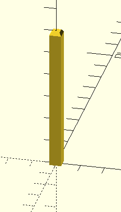
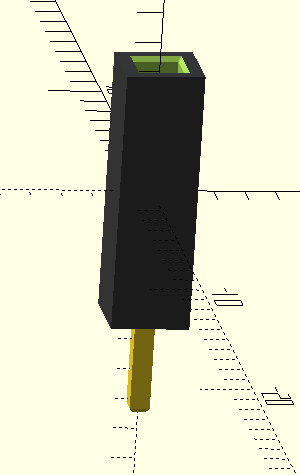
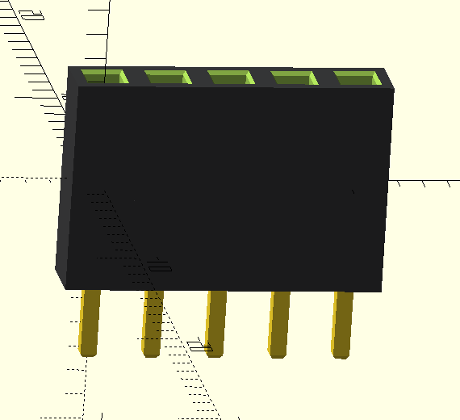
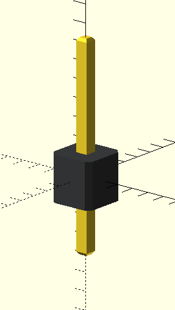
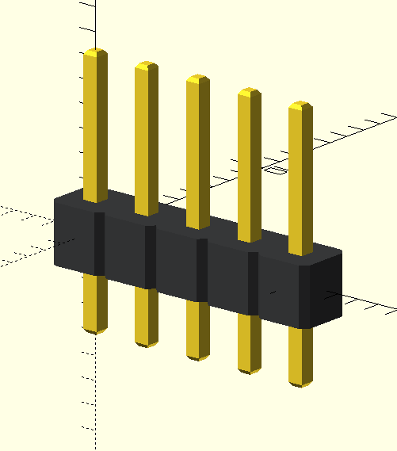

- [1. Screw and bolt generator](#1-screw-and-bolt-generator)
  - [1.1. Available Modules](#11-available-modules)
    - [1.1.1. Screw model](#111-screw-model)
    - [1.1.2. Negative screw model](#112-negative-screw-model)
    - [1.1.2. Hexagon Nut model](#112-hexagon-nut-model)
    - [1.1.2. Negative Hexagon Nut model](#112-negative-hexagon-nut-model)
    - [1.1.3. Available model and metris:](#113-available-model-and-metris)

# 1. Pin header Connectors

## 1.1. Available Modules 

Each module probides functionality to generate pin header connecotrs (standard breadboard compatible).

See below list of available functions on each module.

 |File                             | Single                          | Array                               |
 :--------------------------------:|:--------------------------------:|:------------------------------------:
[common_pin.scad](common_pin.scad) | Generated with `common_pin(6,0.5);`<br/>  |
[female_pin.scad](female_pin.scad) | Generated with `female_pin();`<br/>  | Generated with `female_pin_array(5,1);`<br/> 
[male_pin.scad](male_pin.scad) | Generated with `male_pin();`<br/>  | Generated with `male_pin_array(5,1);`<br/> 
 
 

### 1.1.3. Available model:
- [0_common_pin.scad](0_common_pin.scad)
  
    ```OpenSCAD
        // common_pin(height, in_pin_side, tolerance = 0)
    ```

- [1_female_pin.scad](1_female_pin.scad)
  
    ```OpenSCAD
        // female_pin(pin_entrance_tolerance = 0.4)
        // female_pin(row = 1, column = 1, pin_entrance_tolerance = 0.4)
    ```
- [2_male_pin.scad](2_male_pin.scad)
  
    ```OpenSCAD
        // male_pin()
        // male_pin_array(row = 1, column = 1)
    ```