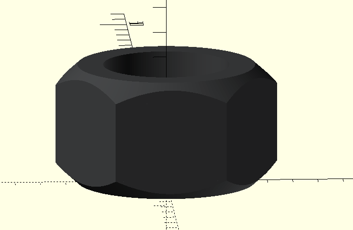
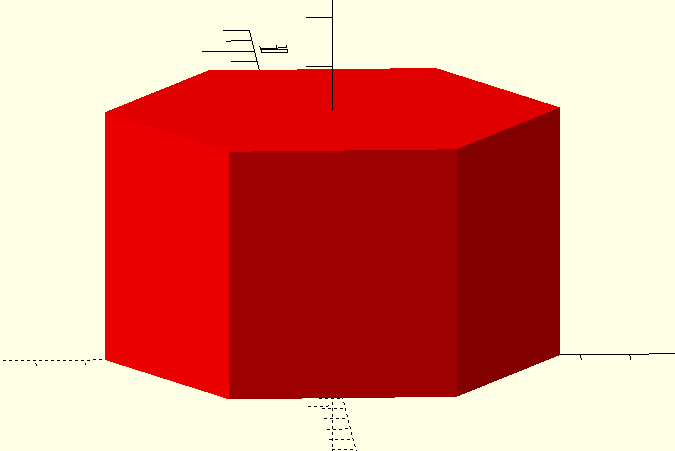

- [1. Screw and bolt generator](#1-screw-and-bolt-generator)
  - [1.1. Available Modules](#11-available-modules)
    - [1.1.1. Screw model](#111-screw-model)
    - [1.1.2. Negative screw model](#112-negative-screw-model)
    - [1.1.2. Hexagon Nut model](#112-hexagon-nut-model)
    - [1.1.2. Negative Hexagon Nut model](#112-negative-hexagon-nut-model)
    - [1.1.3. Available model and metris:](#113-available-model-and-metris)

# 1. Screw and bolt generator


## 1.1. Available Modules 

Each module probides functionality to generate both screw visual for assembly and swer negative, with a given tolerance, to be used with differences on other pieces.

See below list of available functions on each module along with metrics available.
All modules in `screw_nut` folder include a set of model generator to generate the different objects. All this function share a common naming and input parameters:

```OpenSCAD
<type_name>_screw(metric_tag, length);
<type_name>_screw_negative(metric_tag, length, diameter_tolerance, length_tolerance);

// Some excetion might change this, as with nuts that has no length param
```

> Note that `type_name` matches the file name without the numer.

See below examples of each of them:

### 1.1.1. Screw model

Example with allen head screw is:
```OpenSCAD
// metric_tag: string with metric tag, see below the available ones
// length: length of the screw (head included)
allen_screw(metric_tag, length);
```

The following example has been produced with:

```OpenSCAD
allen_screw("M2", 10);
```


### 1.1.2. Negative screw model

Example with allen head screw is:
```OpenSCAD
// metric_tag: string with metric tag, see below the available ones
// length: length of the screw (head included)
// diameter_tolerance: tolerance for the diameter measures (note that is applied once, if you want a radious tolerance multiply by 2)
// length_tolerance: tolerance for the lenght
allen_screw_negative(metric_tag, length, diameter_tolerance, length_tolerance);
```

The following example has been produced with:

```OpenSCAD
allen_screw_negative("M2", 10, 0.2, 0.2);
```


### 1.1.2. Hexagon Nut model

Example with allen head screw is:
```OpenSCAD
// metric_tag: string with metric tag, see below the available ones
hexagon_nut(metric_tag);
```

The following example has been produced with:

```OpenSCAD
hexagon_nut("M5");
```



### 1.1.2. Negative Hexagon Nut model

Example with allen head screw is:
```OpenSCAD
// metric_tag: string with metric tag, see below the available ones
// diameter_tolerance: tolerance for the diameter measures (note that is applied once, if you want a radious tolerance multiply by 2)
// length_tolerance: tolerance for the lenght
hexagon_nut_negative(metric_tag, diameter_tolerance = 0, length_tolerance = 0);
```

The following example has been produced with:

```OpenSCAD
hexagon_nut_negative("M5",0.4,0.4);
```


### 1.1.3. Available model and metris:

- [1_allen_screw.scad](1_allen_screw.scad):
  
    ```OpenSCAD
        // allen_screw(metric_tag, length);
        // allen_screw_negative(metric_tag, length, diameter_tolerance, length_tolerance);
        metrics = ["M1.6", "M2", "M2.5", "M3", "M4", "M5", "M6", "M8", "M10", "M12"];
    ```

- [2_hexagon_nut.scad](2_hexagon_nut.scad):
  
    ```OpenSCAD
        // hexagon_nut(type);
        // hexagon_nut_negative(type, tolerance_diam = 0, tolerance_length = 0);
        metrics = ["M1.6", "M2", "M2.5", "M3", "M4", "M5", "M6", "M8", "M10", "M12"];
    ```