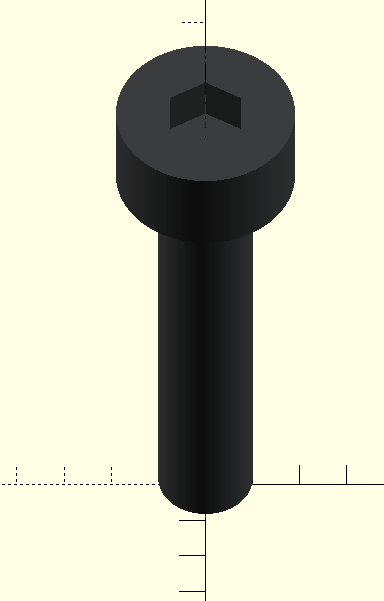
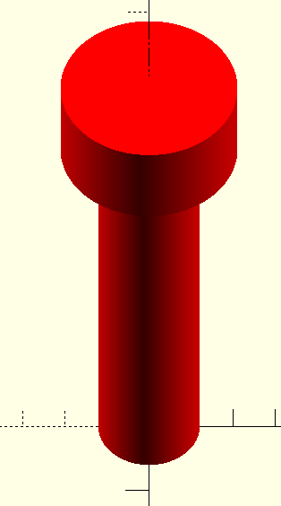

# Screw and bolt generator

Each module probides functionality to generate both screw visual for assembly and swer negative, with a given tolerance, to be used with differences on other pieces.

## Screw model

Example with allen head screw is:
```OpenSCAD
// metric_tag: string with metric tag, see below the available ones
// length: length of the screw (head included)
allen_screw(metric_tag, length);
```

The following example has been produced with:

```OpenSCAD
allen_screw("M2", 10);
```



## Negative screw model

Example with allen head screw is:
```OpenSCAD
// metric_tag: string with metric tag, see below the available ones
// length: length of the screw (head included)
// diameter_tolerance: tolerance for the diameter measures (note that is applied once, if you want a radious tolerance multiply by 2)
// length_tolerance: tolerance for the lenght
allen_screw_negative(metric_tag, length, diameter_tolerance, length_tolerance);
```

The following example has been produced with:

```OpenSCAD
allen_screw_negative("M2", 10, 0.2, 0.2);
```




## Available model and metris:

```OpenSCAD
    // allen_screw(...) and allen_screw_negative(...) functions: 
    metrics = ["M1.6", "M2", "M2.5", "M3", "M4", "M5"];
```