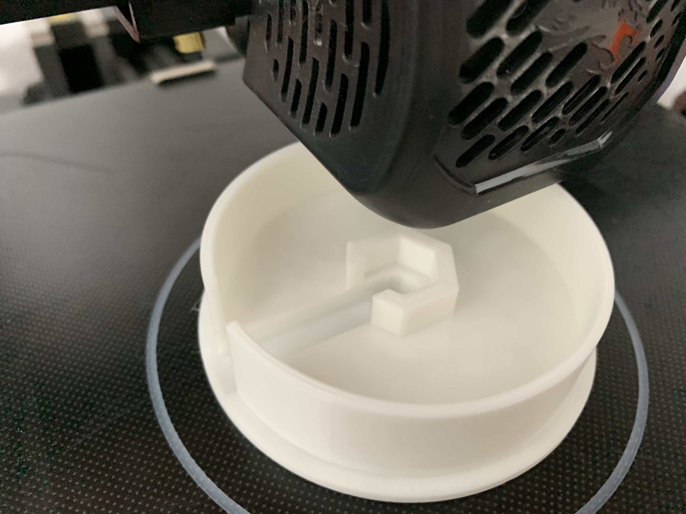
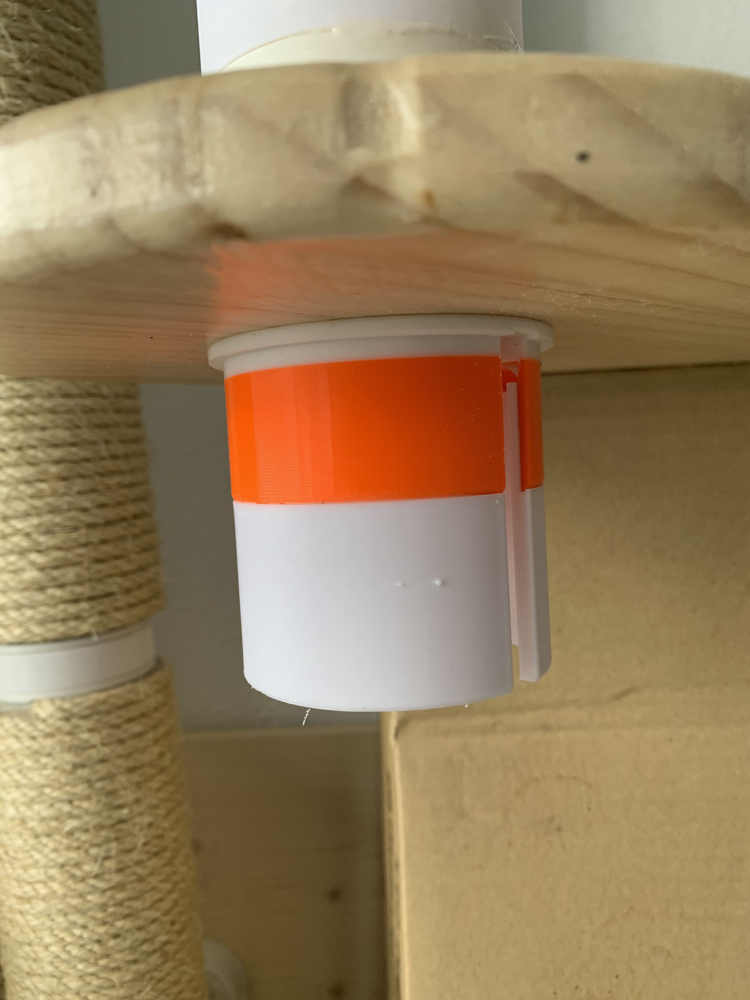
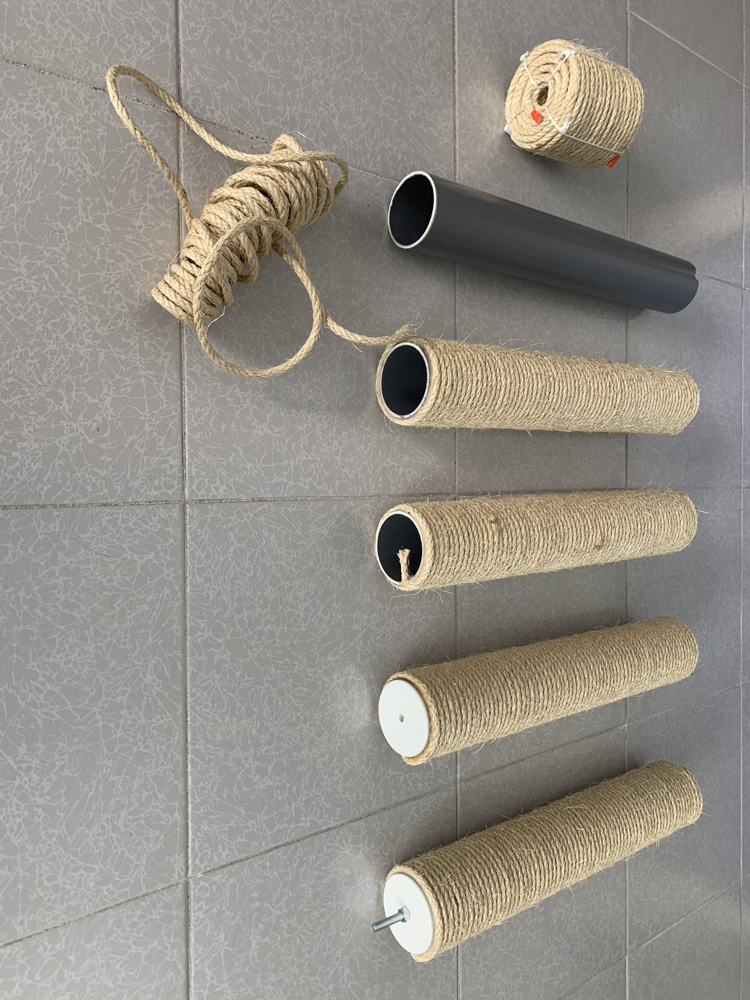

# Cat tree lid

Making some construction for my cats I needed lids for the tubes.

The first version had just one hole for a threaded rod with a nut fitted in the specific whole.

As the result was a bit...'squishi' I had to extend these pieces with an extra part.

The result was quite nice :)
Photo below of the process with the tubes and the final result.

 