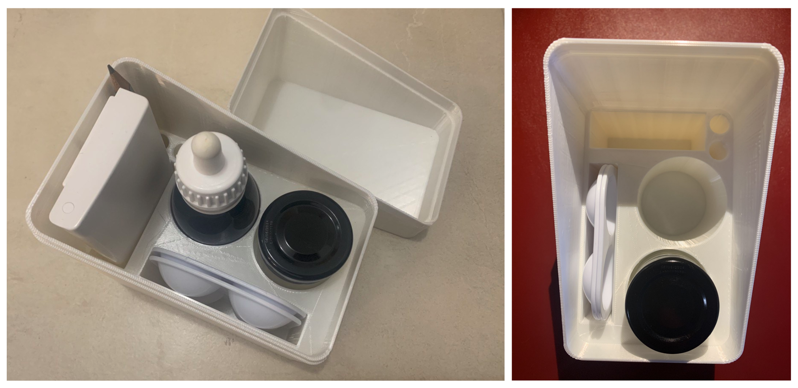
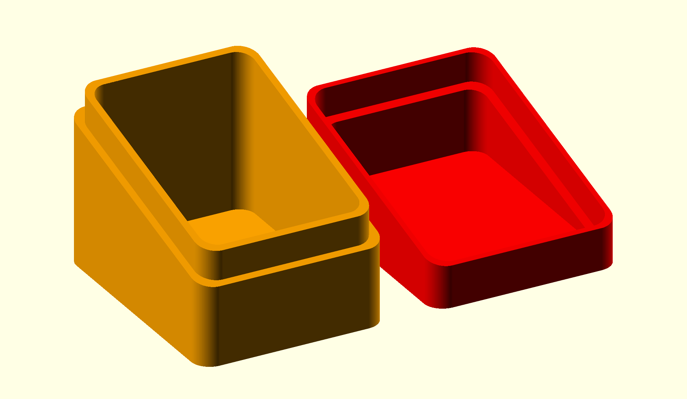
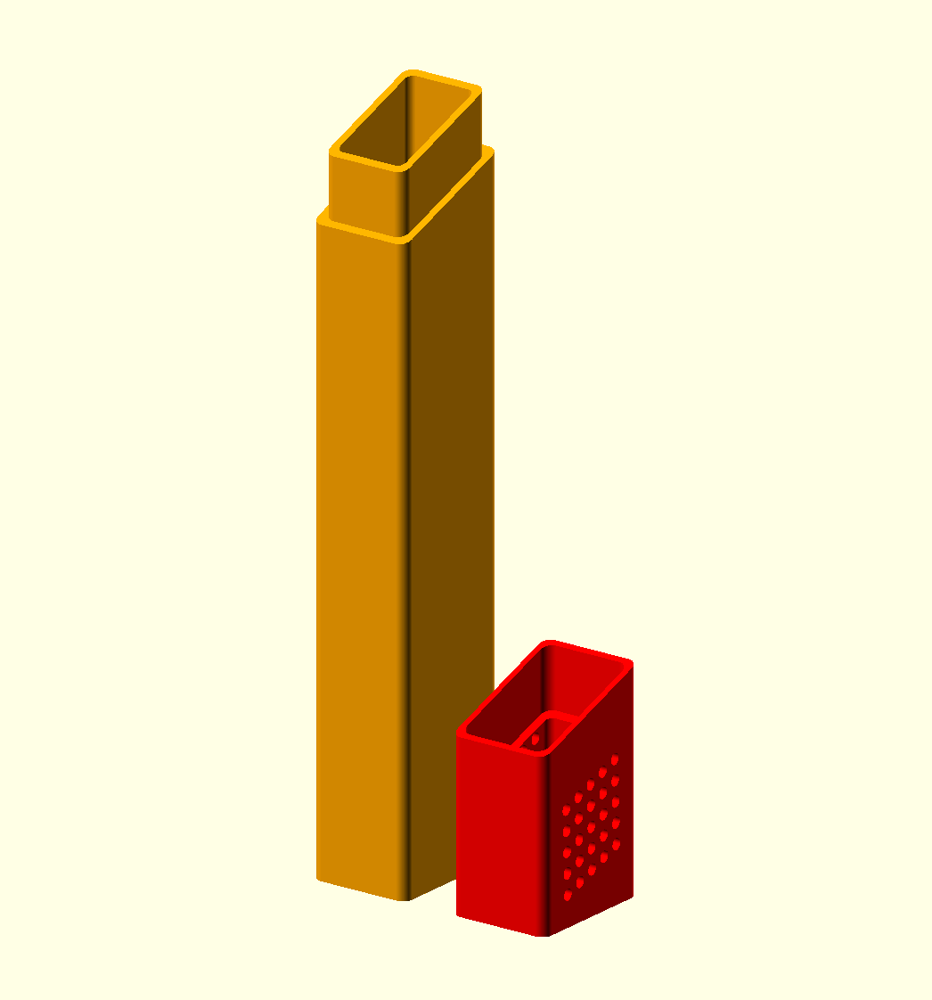
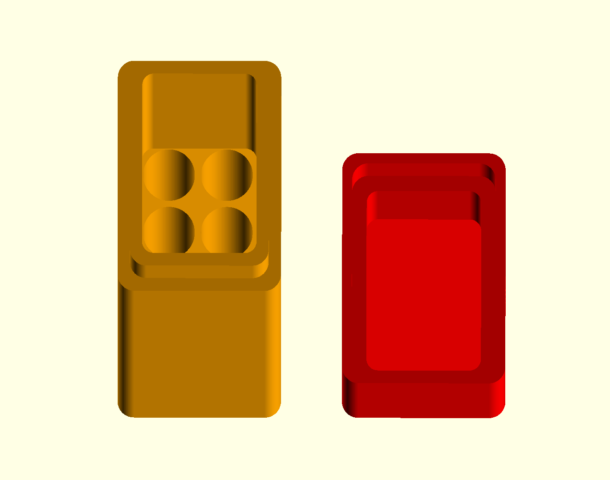
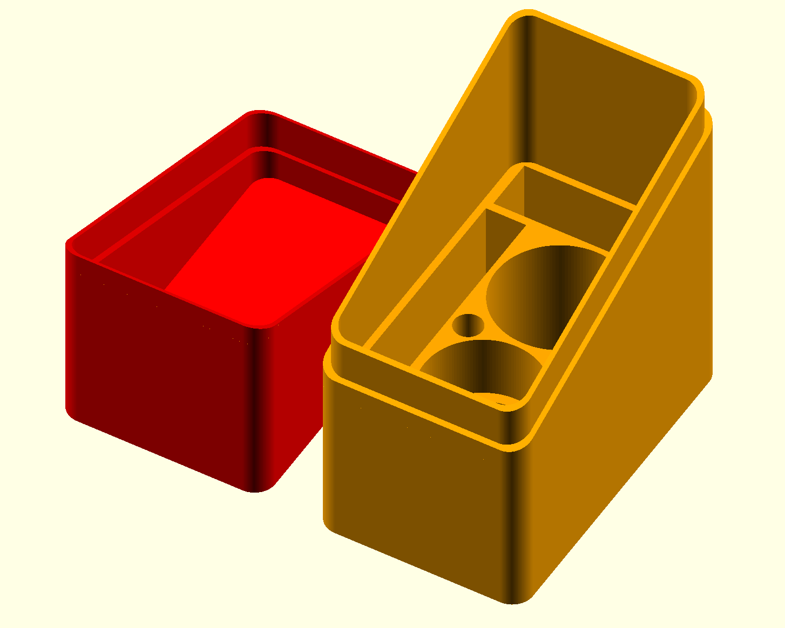

# Box with lid

This model is a parametric model to build a simple rounded corners box with an inclined lid. 
The model has some export options. You can check the "Assembly" view in OpenScad as in the following image. Export each part separately for printing (or not).

The OpenSCAD view of file `box_and_lid.scad` is the following:

This model can also be found and edited in Thingiverse Customizer on [thing 6351803](https://www.thingiverse.com/thing:6351803).
## Custom versions

### Brush box
 

I made a version to hold some brushes, it has some holes in the inside to hold each of them and the lid has little slots for ventilation. The specific model can be checked in `brush_box.scad`. The 'Assembly' view in OpenSCAD looks as:

 

### Watercolor material box

The other version is to hold the rest of the watercolors materials. The specific model can be checked in `aquiarelles_box.scad`. The 'Assembly' view in OpenSCAD looks as:

