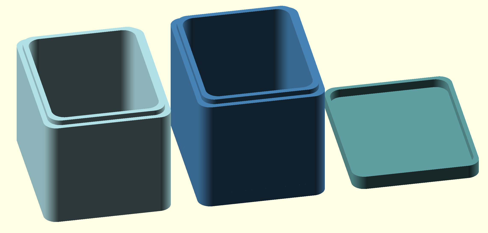
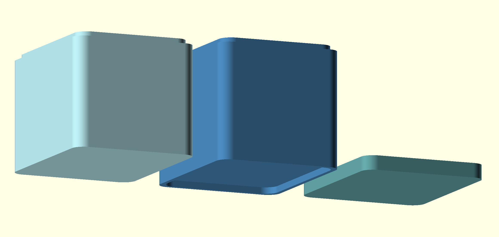
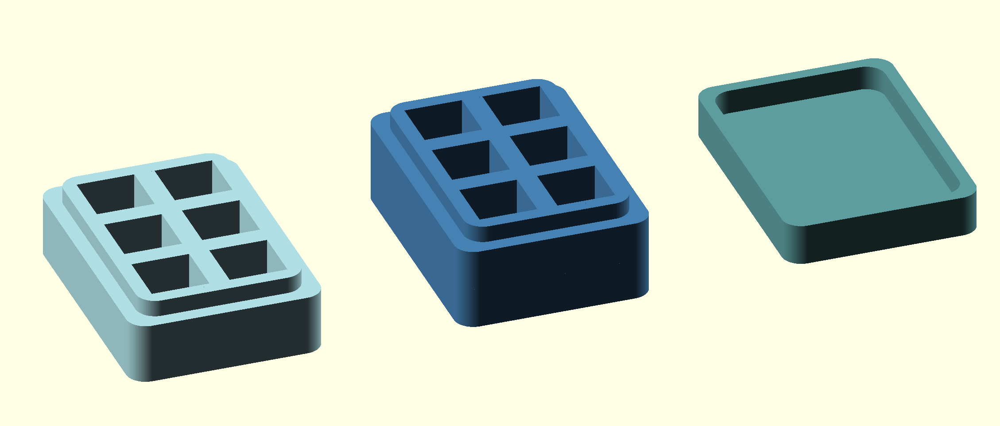
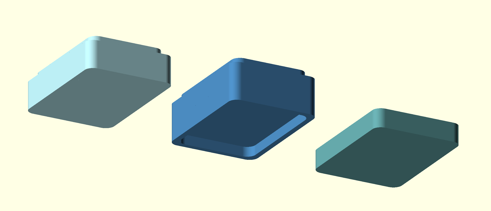

# Stackable box

This model is a parametric model of a rounded edjes stackable box. The 'Assembly' view in OpenSCAD should show the following view (Upper and bottom view).

 

## Custom versions

### Dice box

I made a custom model of this to be able to store some dices or cubes. The 'Assembly' view in OpenSCAD looks as:

 