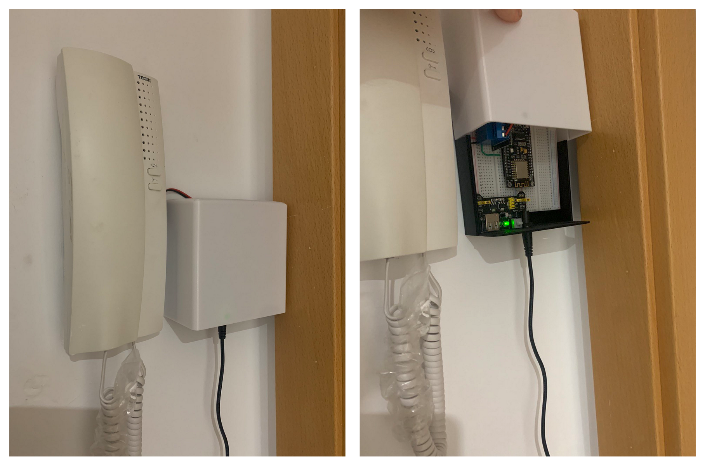
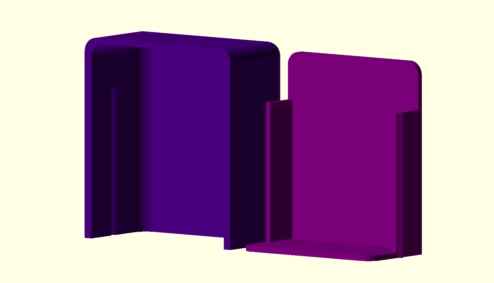
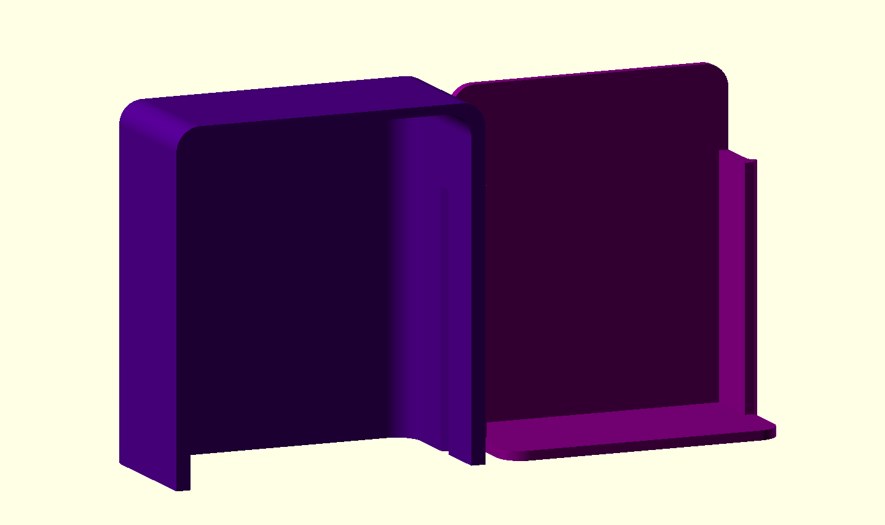
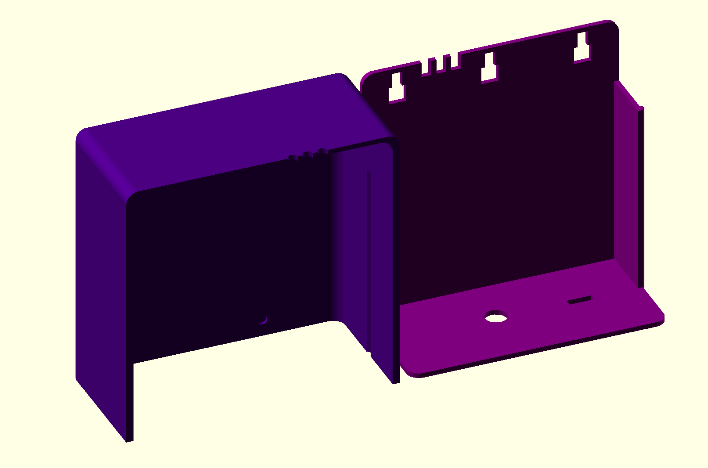
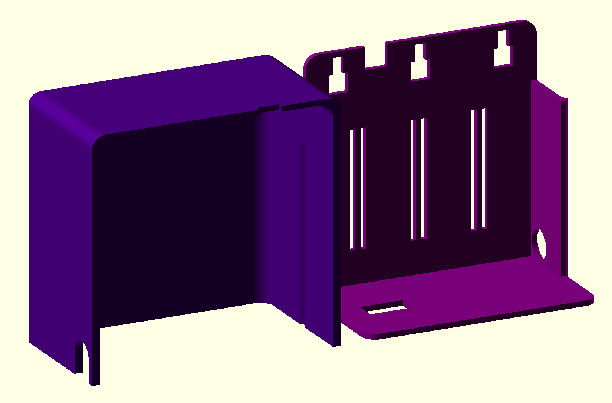

# Sliding lid box

This model is a parametric sliding lid box. I've desinged a specific version to hold some electronics and stuff, but the model can be adapted to other uses. The model can be customized in OpenSCAD with the `sliding_lid_box.scad` file.

## Base design
The view in OpenSCAD is the following when choosing the 'Assembly' export option:

 

## Further customization

Further customization can be performed importing the previous model and adding removing parts. Some examples are described below:

One version made to store some electronics, that added holes for wires and wall-fixing options too can be seen in `doorbell_rele_box.scad`. The model view is the following one:

Another example for other electronic stuff can be found in `curtain_box.scad`:

