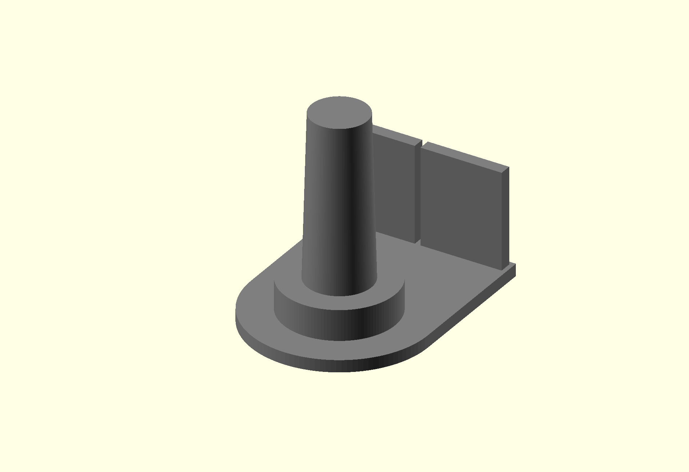
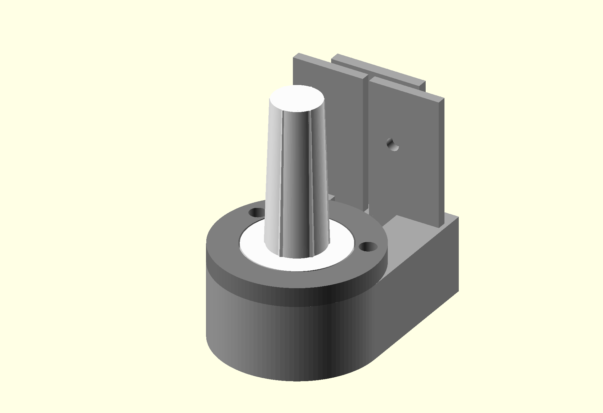
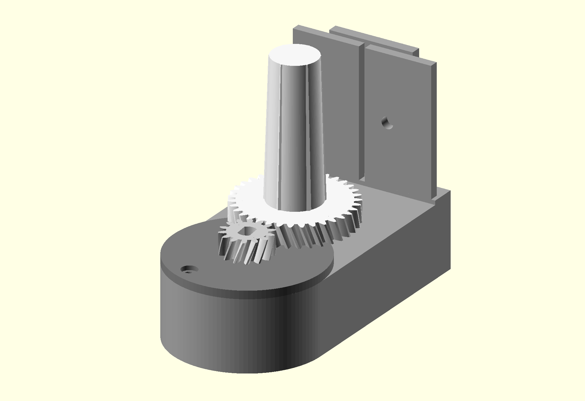
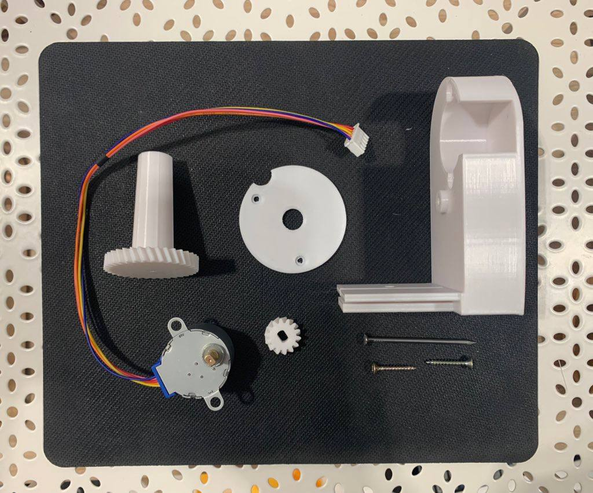
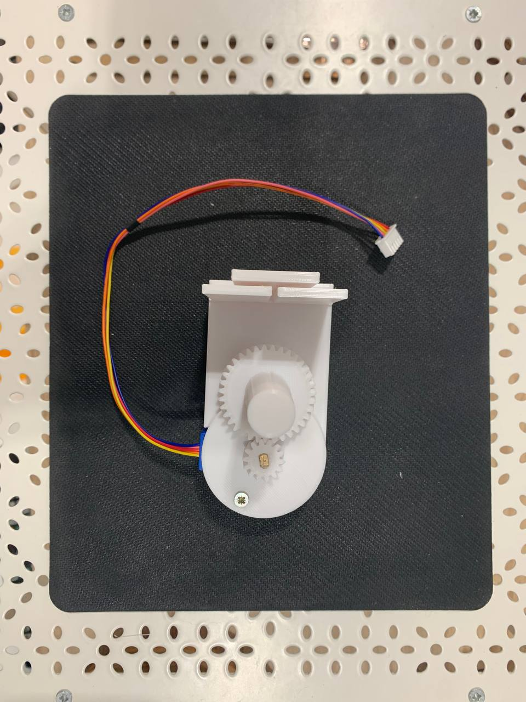
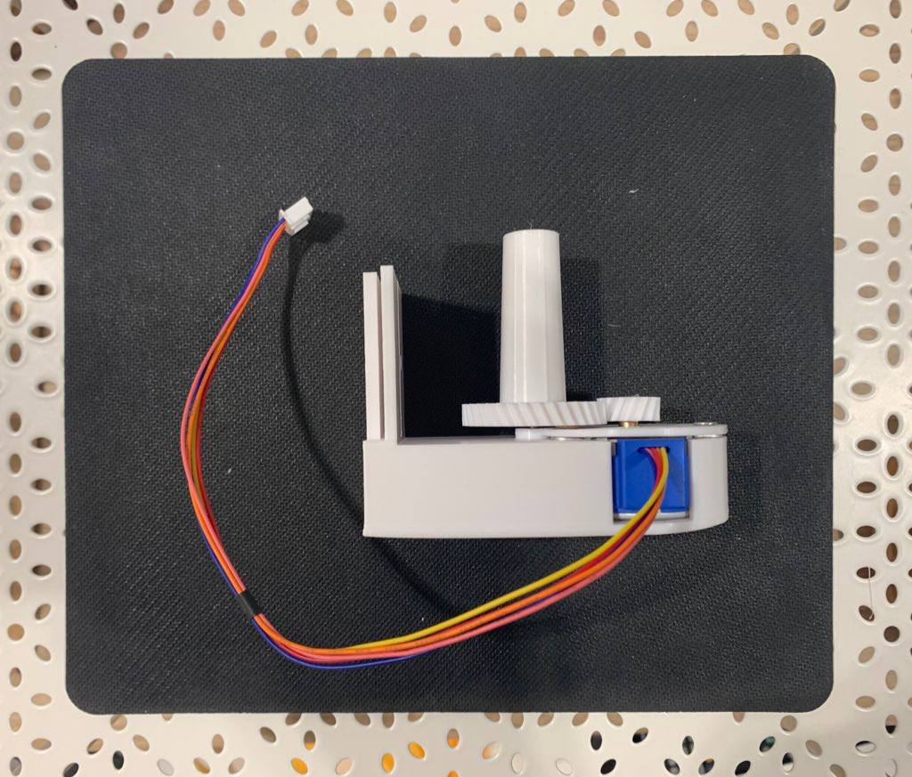
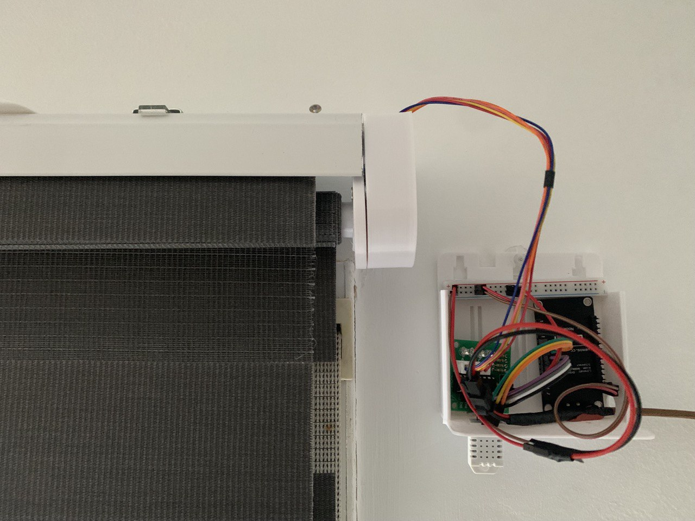

# Curtain automation

First idea taken from [this post](https://www.instructables.com/Motorized-WiFi-IKEA-Roller-Blind/). I had to redesign the pieces as my curtain is a bit different.

First verion (`curtain_steper_box.scad`) had the motor in line with the curtain axis. When tested this motor proved to have not enough torque to move it, so I had to make second version (`curtain_steper_box_v2.scad`), which includes gears to cope with that issue.

In the following images the original piece, the first version and the second version of the model can be seen:

  

In my case is integrated with Home Assistant to handle the automation.

### Materials

For this project I used:
- Stepper motor 28BYJ-48 12v and its driver ULN2003.
- Two screws to fix the motor.
- Nail to fix the curtain axis.
- NodeMCU or similar board to control de motor.
- Voltaje conversor to have both 12v in stepper motor and 3v in board.
- Screw to fix it to the curtain (based on my curtain...).
- Curtain :)

### Printed parts

Is composed by four printed parts:
- Base for the motor and the assembly.
- Lid for the motor.
- Motor small Gear.
- Gear with axis for the curtain.

I also made use of a box for the electronics, taken from [this model](../17_sliding_lid_box/). It is all mounted as in the following image:

## Dependencies
 
Under deps folder theres a gear generation library downloaded from this [Thingiverse Model](https://www.thingiverse.com/thing:4194148).