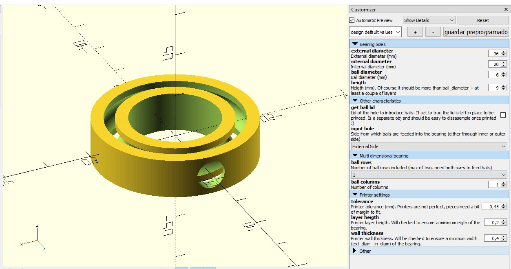
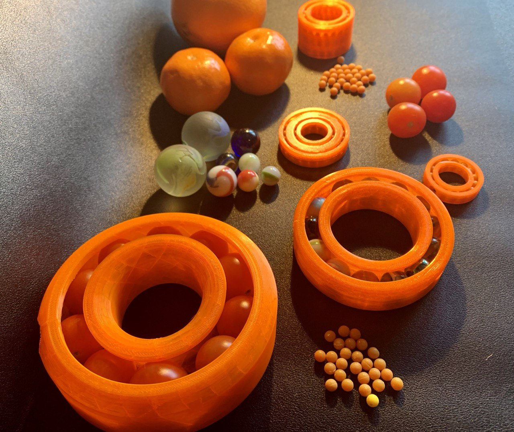

# Parametric ball bearing model

Ball bearin model to be 3d printed in different sizes.

This model can be found and edited in Thingiverse customizable on [thing 4683263](https://www.thingiverse.com/thing:4683263)

Openscad editor has this aspect:

The customizer ofers a set of options that you can play with. I should say that the hole lid of the bearing is not the best, most if the bearing is small. It can be difficult to remove later, take it into account.

Theres a "rounding" option that will let you save a bit of material when doint some random bearing tests (using maybe...tangerines?).

You can customize it to fit whatever spherical shape object you want.

