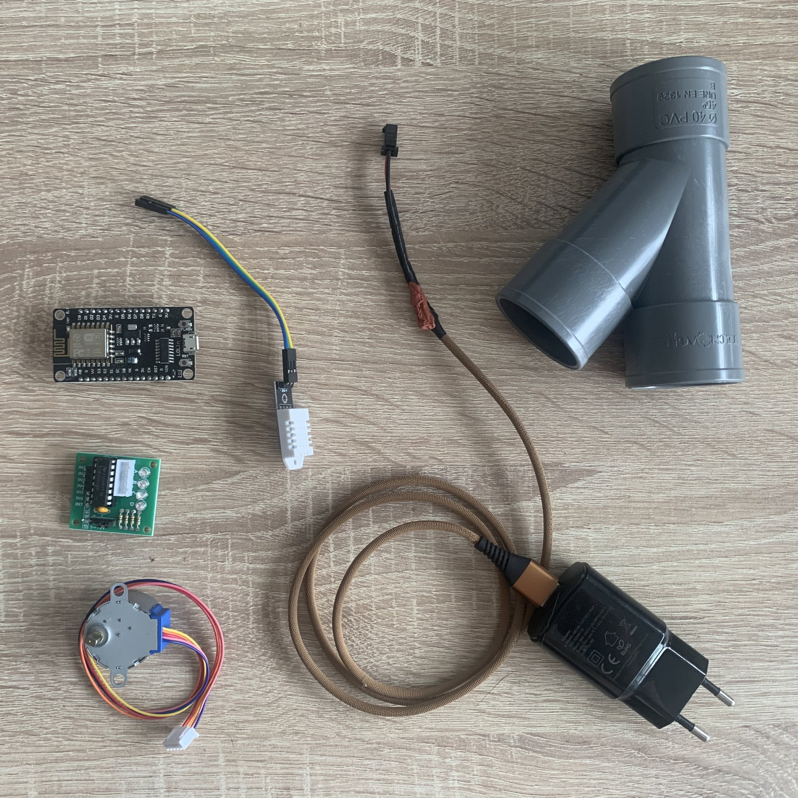
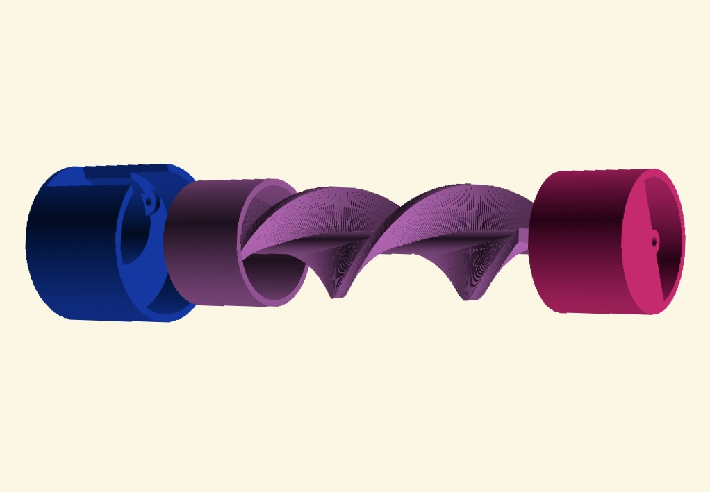
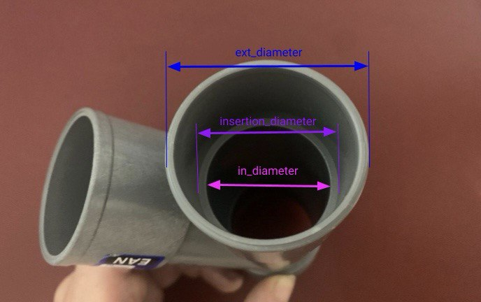
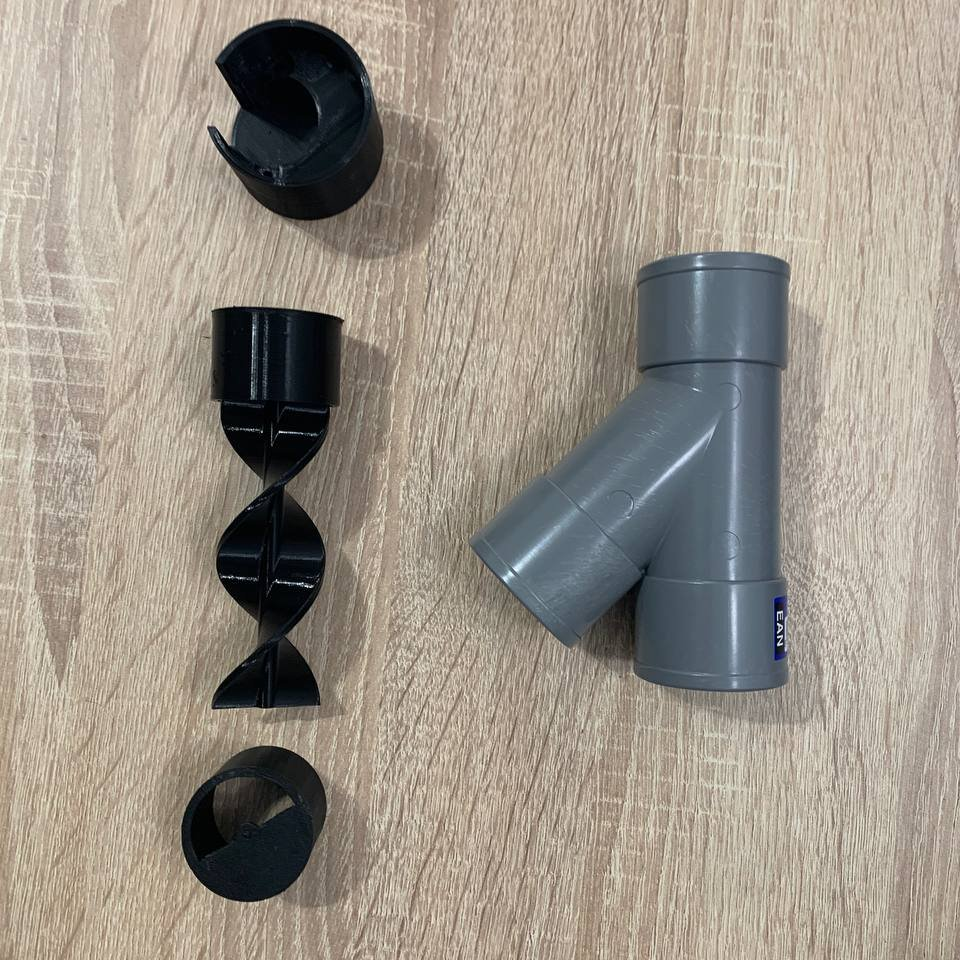
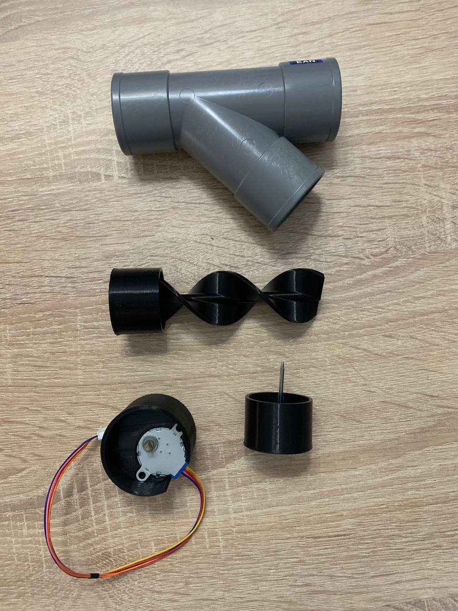
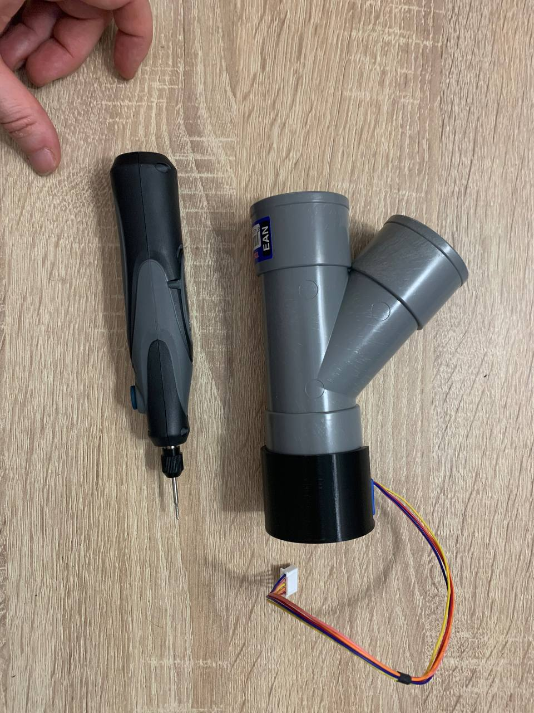

# Automatic cat feeder

I spend some time out from home and I needed something to give some food to my cats between hours. So this is my solution :)

### Materials involved:
- Stepper motor 28BYJ-48 5v and its driver ULN2003.
- Nail to fix the helix.
- NodeMCU or similar board to control de motor.
- T shaped PVC tube (in my case it has a 45 degree angle, which I though could be good for this).

### Printed parts

The design includes three printed parts: 
- Support for the motor
- Helix to push the food out
- End lid to fix the helix and limit the out space

The diameters to tune the model can be a bit confgusing at first glance, take the following image as a reference:

The assembly just needs to fix the motor on its slot and make use of a nail to fix the lid with the helix so it does not move. 

I also made use of a box for the electronics, taken from [this model](../17_sliding_lid_box/).

In my case is all integrated with Home Assistant to handle the automation.
