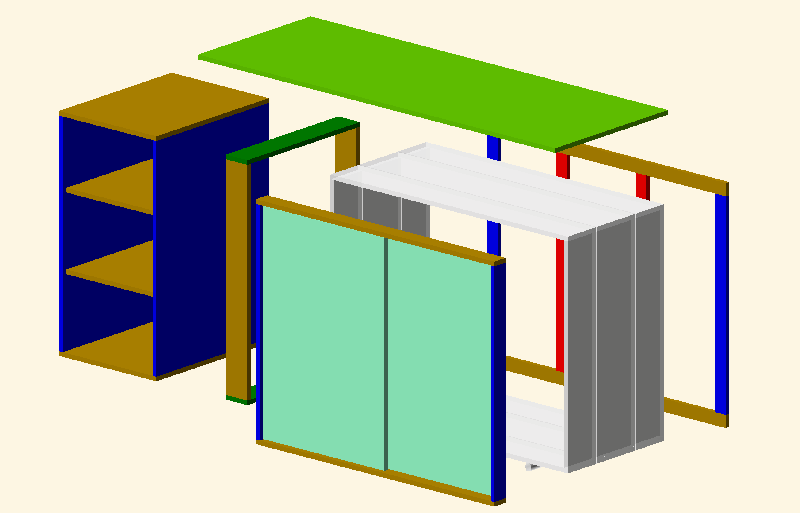
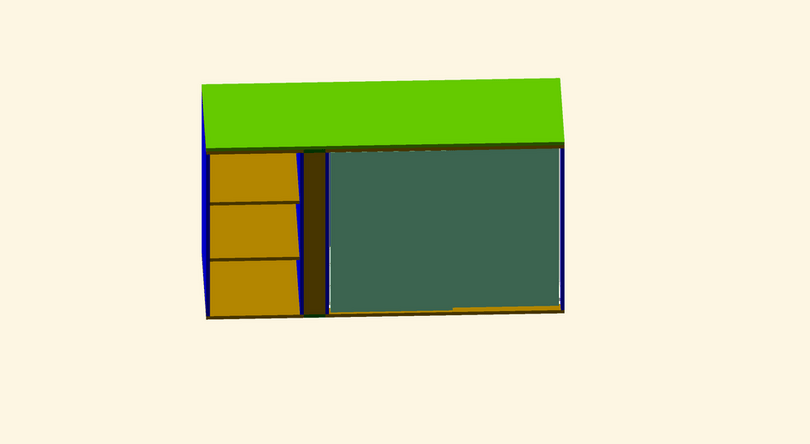
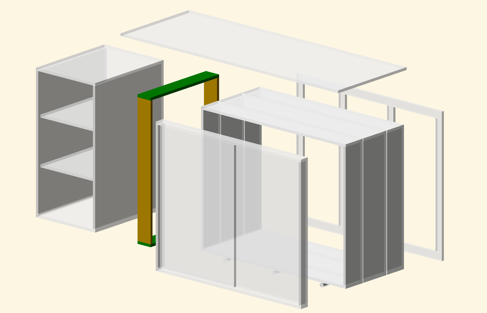
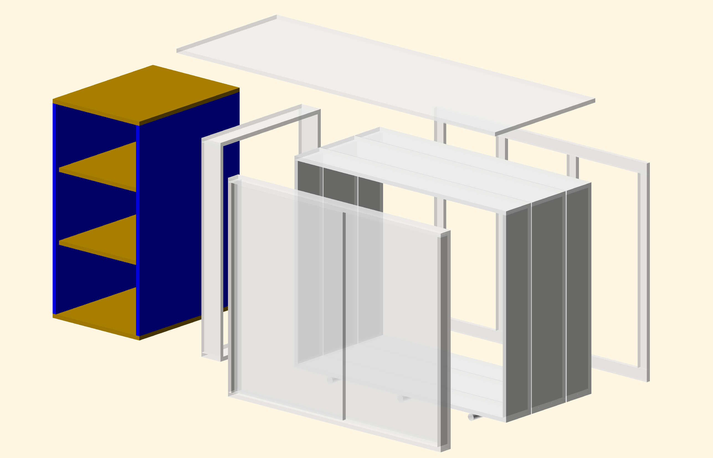
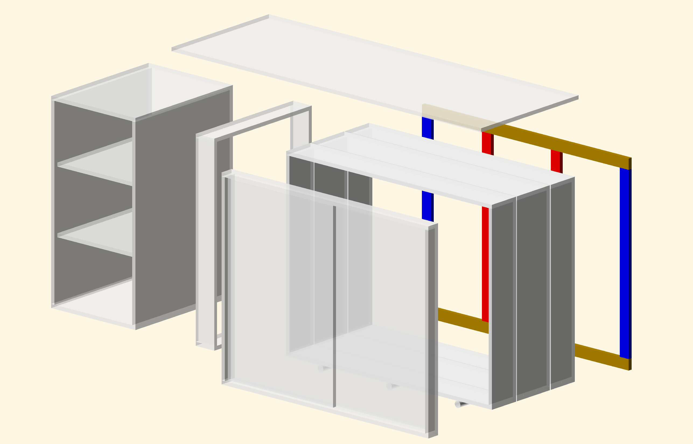
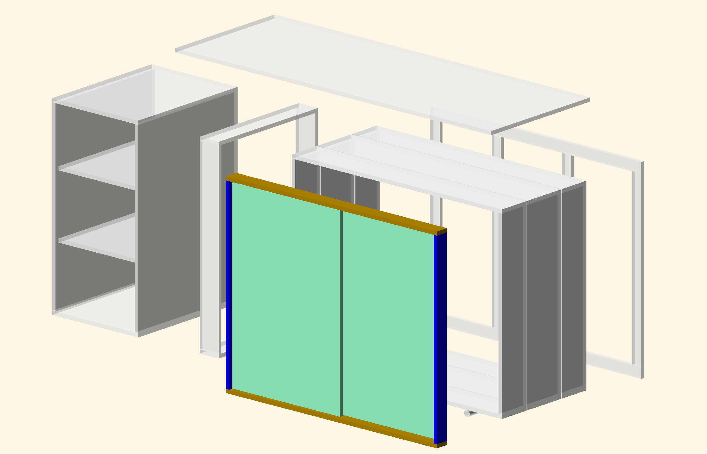
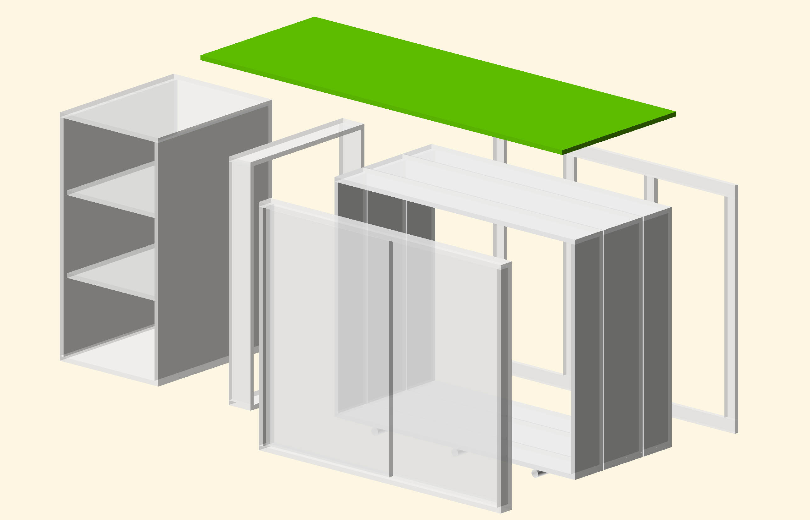
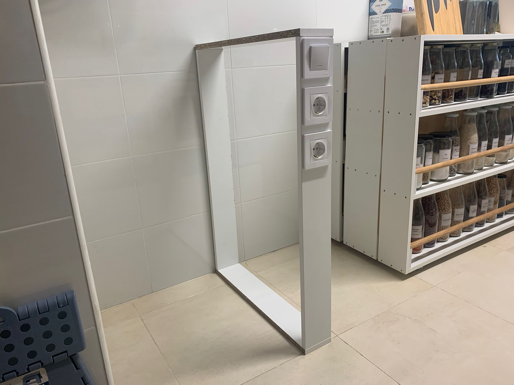
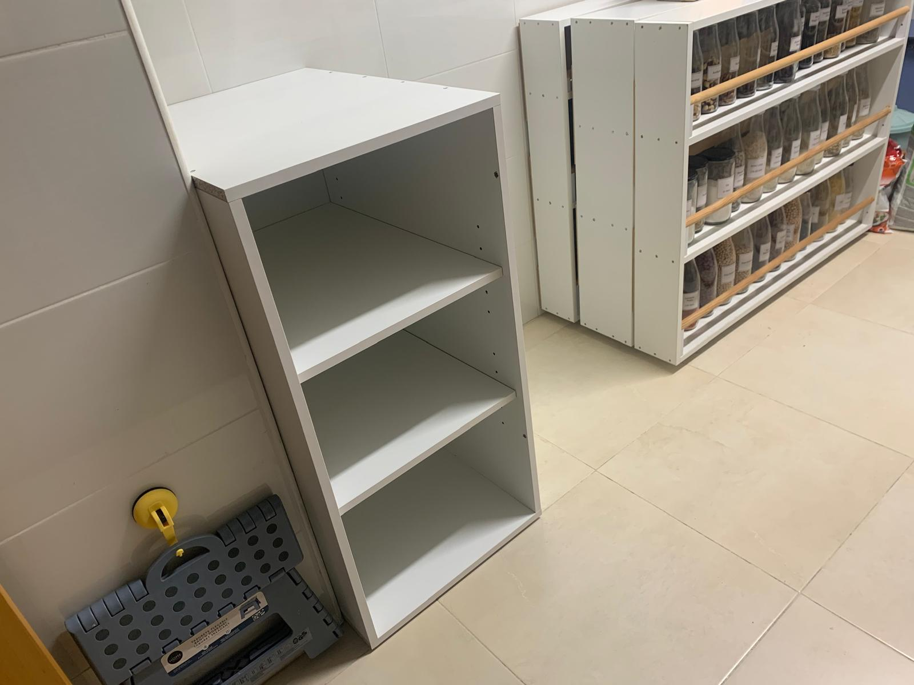

# Kitchen furniture

This is not a 3D printing project but a wood one. I used OpenScad to design the pieces and to have a clear view of which boards will I need to order.

The global view is the following:

I opted for a modular design, as the complete version is a bit big and I might need to move to another house. The model is split into five modules:

Theres a map of all the material needed in `maedra_encargo.pdf` and a simplified BOM of the boards in `BOM maderas encargo.df`. A python script,`generate_bom.py`, is used to execute the openscad generation and extract the BOM, in a predefined format, from the log output of the .scad file. The result is stored in `bom_boards.csv`.