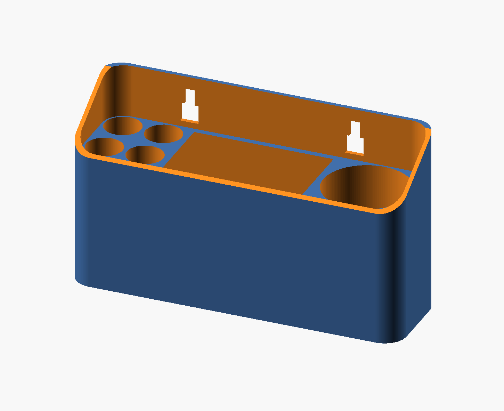

# Whiteboard Material Stand

This model is a OpenScad project to store some whiteboard material hanged in the wall. The OpenScad and printed model looks as in the following images:

It includes slots for four markers, a cleaner and some alcohol for a better cleaning. It's also prepared to be fixed to the wall.