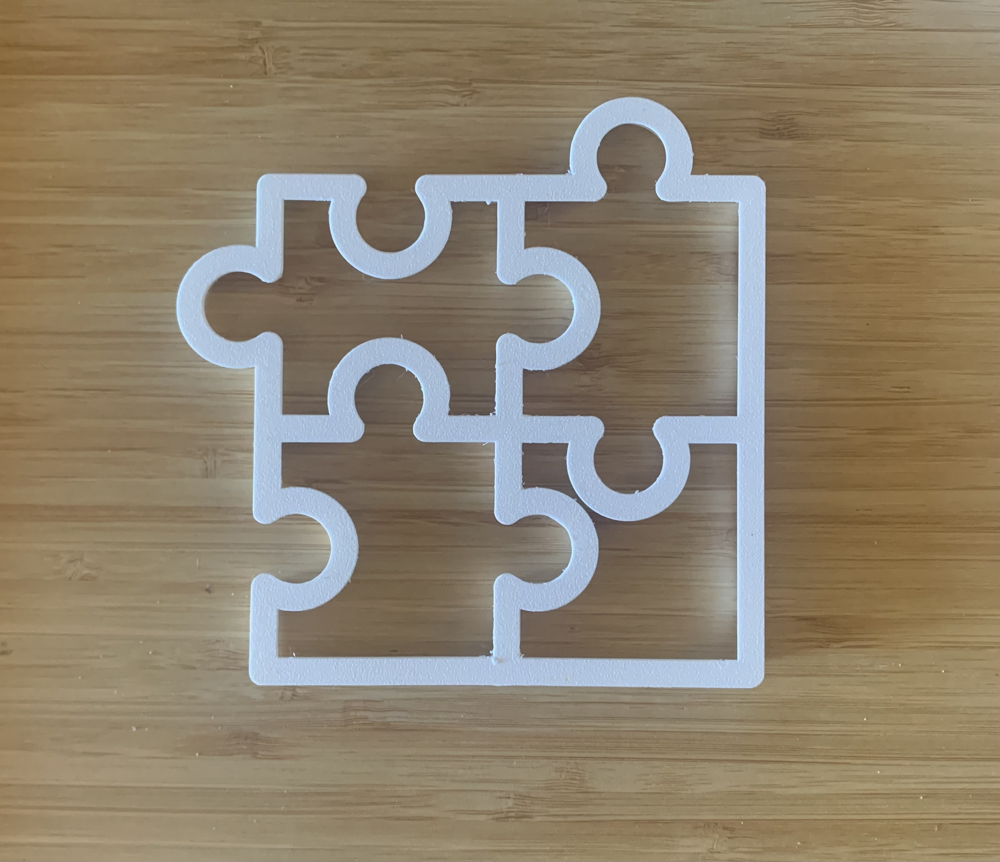

# Cookie cutter

Model that generates a coockie cutter based on a `.svg` file. Note that it takes a bit to compute the final 3d model :)

Here an example of a model for a cookie puzzle, both printed model and cookie result:

