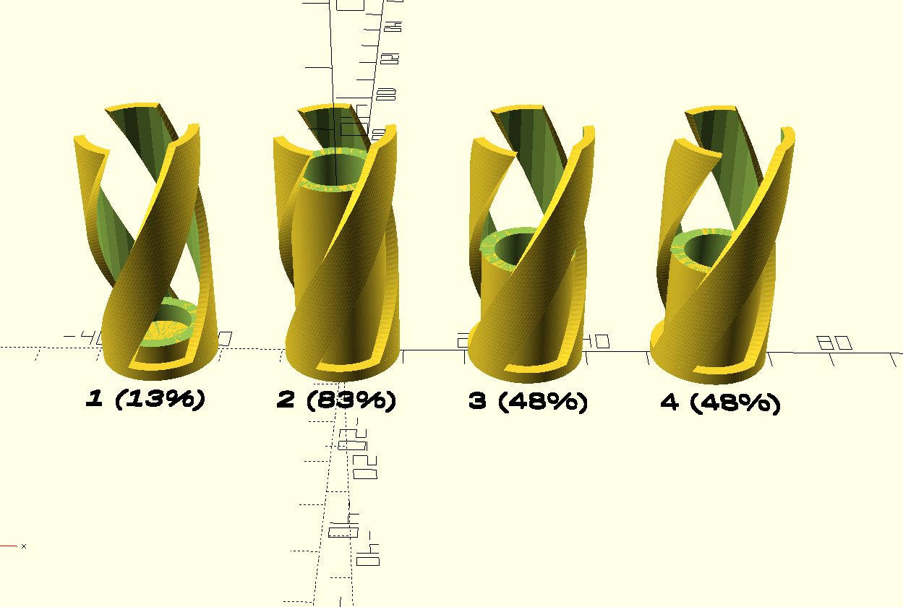
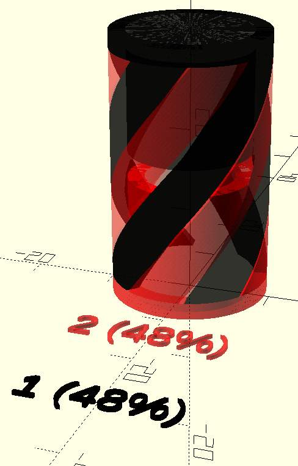
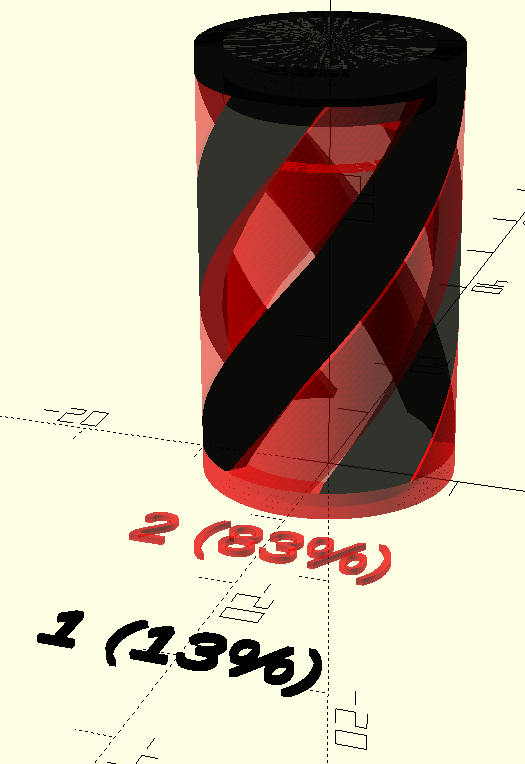
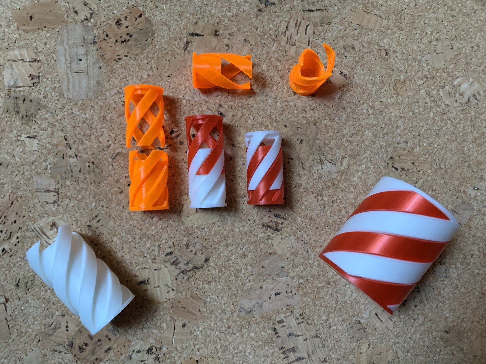

# Parametric Screw Box Model

Screw Box to be 3d printed with different sizes.

This model can be found and edited in Thingiverse Customizer on [thing 4703135](https://www.thingiverse.com/thing:4703135)

Some time ago I made a similar design ([thing 662476](https://www.thingiverse.com/thing:662476)) based on this one: [thing 582221](https://www.thingiverse.com/thing:582221).

In Openscad editor has the following aspect.

The customizer ofers a set of options that you can play with. You will have two print two versions, check the percentaje for each of the parts.

> Regarding the percentages, in the previous image pieces (1) and (2) would fit together as (3) would do with (4).

 |          Same percentage                   |             Complementary percentage              |
 :--------------------------------:|:--------------------------------:|
 |   |

I recommend printing one with most of the container and the other with little percentage as the cup, but it's up to you.

Do not hesitate adapting it to your needs :)

You should get something like this!

