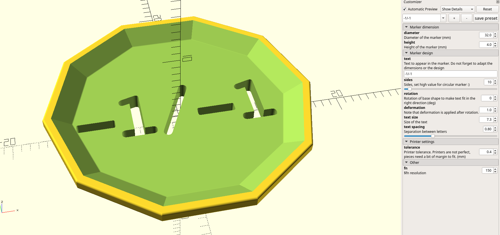
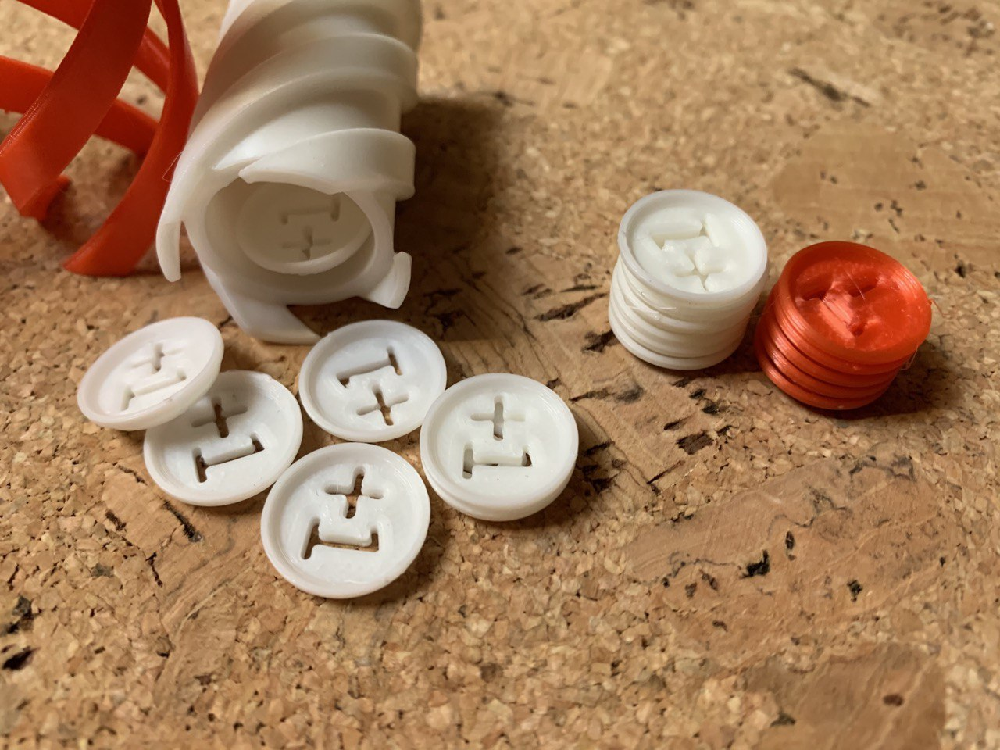
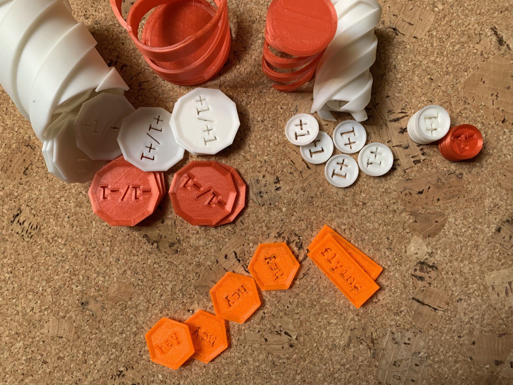

# Parametric Game Tag/Marker/Counter

Parametric stackable marker to be customized and printed (if you are lucky to have a resin 3d printer the result is much better with the text).

This model can be found and edited in Thingiverse Customizer on [thing 4703926](https://www.thingiverse.com/thing:4703926)

At first the model was intended to make some stackable counters for Magit The Gathering games, but it can be used to any other game that needs this type of counters.

In Openscad editor has the following aspect.

The customizer ofers a set of options that you can play with. You can change the shape, text and dimensions!

Do not hesitate adapting it to your needs, try the different shapes, dimensions and text! :)

## Customization
You can find the params I used in the `stackable_game_marker.json` with some of the models in the Image.

You can also find the parametrization I used to print `screw box` for these designs can be found in `screw_box.json`. The model is both in Thingiverse ([thing 4703135](https://www.thingiverse.com/thing:4703135)) or in this repository under [3_screw_box](/misc/3_screw_box)

## Examples

I made some of them, see how nice they look!

