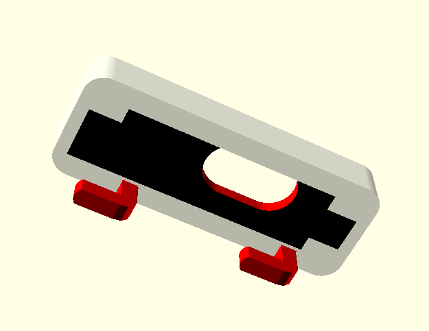

# Ikea Skadis board 3d print complements

- [Ikea Skadis board 3d print complements](#ikea-skadis-board-3d-print-complements)
  - [Models](#models)
    - [1. Board](#1-board)
      - [1.1 skadis_board.scad](#11-skadis_boardscad)
    - [2. Hook](#2-hook)
      - [2.1 File skadis_simple_hook.scad:](#21-file-skadis_simple_hookscad)
    - [3. Screen](#3-screen)
      - [3.1. File screen_stuff/screen_buttons.scad:](#31-file-screen_stuffscreen_buttonsscad)
      - [3.2. File screen_stuff/screen_speaker.scad:](#32-file-screen_stuffscreen_speakerscad)
      - [3.3. File screen_stuff/screen.scad:](#33-file-screen_stuffscreenscad)
      - [3.4 File screen_stuff/screen_control_board.scad:](#34-file-screen_stuffscreen_control_boardscad)
    - [4. Power Strip](#4-power-strip)
      - [4.1. File power_strip_clip.scad:](#41-file-power_strip_clipscad)
    - [5. Board clip](#5-board-clip)
      - [5.1. File skadis_rpy3aplus_clip.scad:](#51-file-skadis_rpy3aplus_clipscad)
    - [6. Assembly](#6-assembly)
      - [6.1. File assembly.scad:](#61-file-assemblyscad)
  - [Printed and mounted view](#printed-and-mounted-view)

In this folder there are a set of objects I needed to attach to a Skadis board from IKEA. Each file has a set of modules to produce each of the objects.
You can check each model and adapt it to your needs in case you have a similar board.

## Models

### 1. Board

A model of the Skadis Board to make tests based on it.
#### 1.1 [skadis_board.scad](skadis_board.scad)

The board, with my specific size (note that there are different sizes available) and color looks like this:
|  |
|---|

### 2. Hook

To fix each of the pieces to the board theres a simple hook designed that has model for the single version or for an array of them. This piece is later integrated into the rest.
#### 2.1 [File skadis_simple_hook.scad:](skadis_simple_hook.scad)

| Simple Hook | Array of Hooks(2,2) |
|---|---|
|  |  |

### 3. Screen

This set of objects is made to fix an old-laptop-screen to the board.

#### 3.1. [File screen_stuff/screen_buttons.scad:](screen_stuff/screen_buttons.scad)

To control the screen there's a keypad that needs to be fixed. The clip looks like this:
|  |  |
|---|---|

#### 3.2. [File screen_stuff/screen_speaker.scad:](screen_stuff/screen_speaker.scad)

I have a pair of small speakers from another screen that need to be fixed close to the screen too. The clip for them looks like this:
|  |
|---|

#### 3.3. [File screen_stuff/screen.scad:](screen_stuff/screen.scad)

The actual screen with its clips to be attached to the board:
|  |  |
|---|---|

#### 3.4 [File screen_stuff/screen_control_board.scad:](screen_stuff/screen_control_board.scad)

The control board of the screen to have default interfaces, connection for speakers and buttons:
|  |
|---|

### 4. Power Strip

#### 4.1. [File power_strip_clip.scad:](power_strip_clip.scad)

A 3 power outlet (+ 3 USB) power strip with the attachment to the board:
|  |
|---|

### 5. Board clip

#### 5.1. [File skadis_rpy3aplus_clip.scad:](skadis_rpy3aplus_clip.scad)

The attachmet for a Raspberry Pi 3A+ that has the HASSIO integrated. It connects to the screen through an HDMI cable.
|  |
|---|

### 6. Assembly

#### 6.1. [File assembly.scad:](assembly.scad)
I used this file to check that some of the bigger object clips actually fitted into the board:
|  |  |
|---|---|

## Printed and mounted view

With all printed and mounted has the following aspect :)

