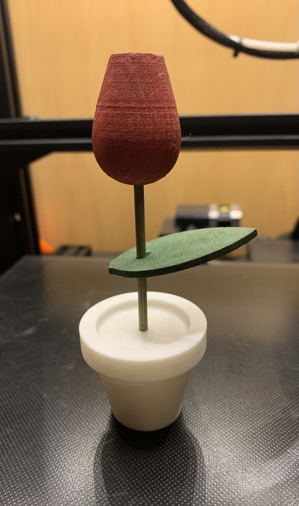
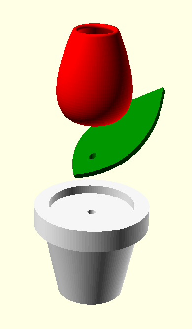
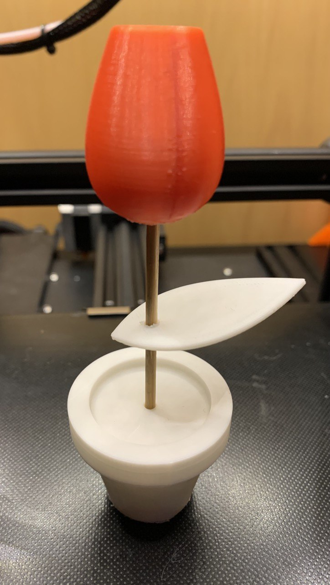

# Parametric Wooden Stick Single Flower

So my mother had this thing for a lot of time, actually I don't remember when it was bought. At some point the pot was lost so I decided to make it a new one so the flower could stop being without a place to rest.

But why stop there? It's really interesting to model also the flower and the leaf, they are really simple models that can be parametriced using Bezier curves., which is something interesting to play with. You can check about Bezier curves in this nice [tutorial](https://www.youtube.com/watch?v=dXECQRlmIaE&list=RDCMUCF6F8LdCSWlRwQm_hfA2bcQ&start_radio=1&t=30) (and chapter [20](https://www.youtube.com/watch?v=2hL1LGMVnVM) too). And of course you can check this code example for it.

The three pieces are fixed together with a wooden stick, just dont forget to set the correct parameter for it along with the tolerance (note that usually diameter apply the tolerance*2; in this case is only taken once for a more fit insertion).

If you just want a simple flower that won't need much care, just go and play with the model!

> Note that the flower takes its time to render and generate, it's a bit complex, sorry :)

This model can be found and edited in Thingiverse Customizer on [thing 4725740](https://www.thingiverse.com/thing:4725740).

> Another thing I find quite interesting is Voronoi diagrams, and its posibilities with 3D shapes, they look really cool. I made this Voronoi looking piece making use of Meshmixer. You can find this verion on [thing 4725749](https://www.thingiverse.com/thing:4725749). 

 | Original with printed pot | Openscad Assembly view |  Full printed model | Voronized version |
 :--------------------------------:|:--------------------------------:|:--------------------------------:|:--------------------------------:|
   |  |  |

What strange model can you get? Do not hesitate on sharing the model!