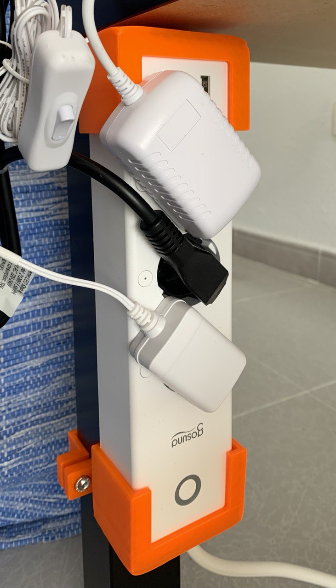
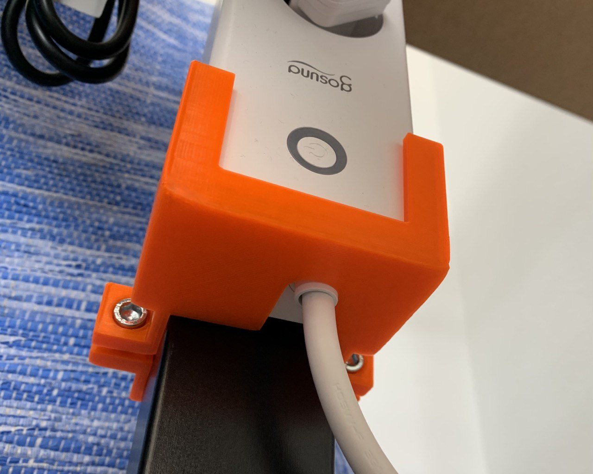

# Parametric Power Outlets Strip Holder

This model is to hold a power outlet strip to a talbe leg. You can edit it to fix most of power outlet strips and table leg (rectangular shaped). Visually does not to see so nice, but you know, the beauty is inside, in the design in this case. You can customice it to fit many power strip and table shapes! 

This model can be found and edited in Thingiverse Customizer on [thing 4703926](https://www.thingiverse.com/thing:4766799).

The holder is composed by two pieces placed at each end of the strip (need to export twice with different parameters for the cable hole). It is fixed making use of two pairs of screw-nut on each piece. It is recommended (almost mandatory) to add some anti-slip sticker to it to avoid moving. Take this sticker into account when parametricing the leg dimensions.

You can see the view in openSCAD of both versions, one for the upper side without cable hole, and the one that should go at the bottom (well, you can mount to however you want; in my opinion is better to leave the cable at the bottom).

 | Upper side | Lower side with cable |
 :--------------------------------:|:--------------------------------:|
   |  

I added some anti slip rubber I bought in the supermarket (yeah, you can use whatever). I put them in the pieces to "stick" to the table leg and not move:

You can check a couple of examples printed by myself:

 | Example 1 | Example 2 |
 :--------------------------------:|:--------------------------------:|
   |  
   |  

> Example 1 is based on default model and `CableSide` version in params `power_outlet_strip.json`.

> Example 2 is based on `EnderTable` and `EnderTableCable` version in params file `power_outlet_strip.json`.

Would you share your versions? 

Enjoy!