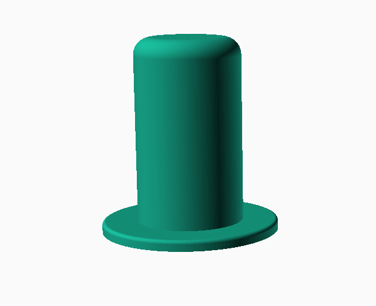
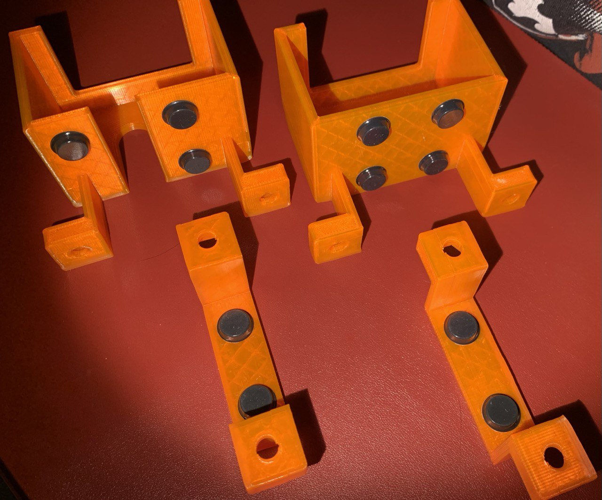

# Floating toilet paper

This model can be printed to place toilet rolls in the wall and give them any shape you want. I don't have much space in the cabinets so it's a really nice saving-space solution.

This model is based on [thing 3547534](https://www.thingiverse.com/thing:3547534), that can be found Thingiverse. I have been using this model some time, but now that the rolls I buy changed size I had to adapt it.

Main changes are adding a bigger sticking base, as the original ones kept falling from the wall. I use double sided tape and I need some extra space. I also reshaped it a little and made the parametric version based on OpenScad to have more options when cusotmizing it (the other one could easily be changed in any slicer but...).

This model can be found and edited in Thingiverse Customizer on [thing ??](??).

The model itself has the following appearance:

You can check it once printed:

And this is in my bathroom with some of them already placed!

It is really simple, but nice :)
Would you share your paper roll designs in the wall? 

Enjoy!